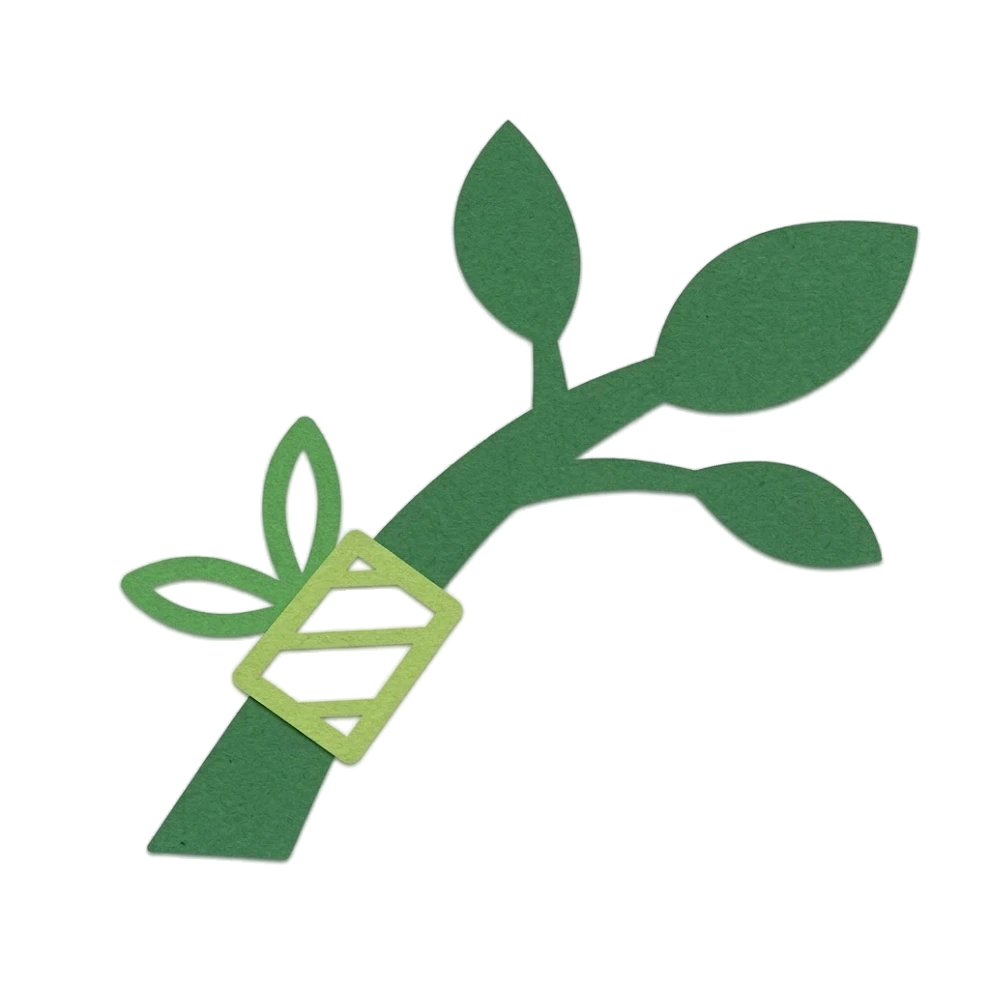

<div align="center">



# GRAFT: Geometric Refinement and Fitting Transformer for Human Scene Reconstruction

<p>
  <a href="https://pradyumnaym.github.io/" target="_blank">Pradyumna YM</a> ·
  <a href="https://yuxuan-xue.com/" target="_blank">Yuxuan Xue</a> ·
  <a href="https://fanegg.github.io/" target="_blank">Yue Chen</a> ·
  <a href="https://virtualhumans.mpi-inf.mpg.de/people/Kister.html" target="_blank">Nikita Kister</a> ·
  <a href="https://istvansarandi.com/" target="_blank">István Sárándi</a> ·
  <a href="https://virtualhumans.mpi-inf.mpg.de/people/pons-moll.html" target="_blank">Gerard Pons-Moll</a>
</p>

<p>
  <a href="https://pradyumnaym.github.io/graft/"></a>
  <a href="#"></a>
  <a href="https://arxiv.org/abs/2604.19624"></a>
  <a href="#"></a>
</p>

</div>

**TL;DR** — A learned HSI prior that predicts iterative geometry-grounded refinements to reconstruct humans in scenes from a single image. Matches optimization-based contact quality at **~50× lower runtime**; as a plug-and-play prior it boosts existing methods by up to **44%** contact F1 — no retraining needed.


https://github.com/user-attachments/assets/0ce2b017-afa6-49c5-a016-d007e1ef7a93


## Roadmap

- [x] Project page
- [x] arXiv paper
- [ ] Demo release
- [ ] Code release

## BibTeX

If you find our work useful, please consider citing:

```bibtex
@misc{ym2026graft,
  title        = {GRAFT: Geometric Refinement and Fitting Transformer for Human Scene Reconstruction},
  author       = {Pradyumna YM and Yuxuan Xue and Yue Chen and Nikita Kister and Istv{\'a}n S{\'a}r{\'a}ndi and Gerard Pons-Moll},
  year         = {2026},
  eprint       = {2604.19624},
  archivePrefix = {arXiv},
  url          = {https://arxiv.org/abs/2604.19624},
}
```


